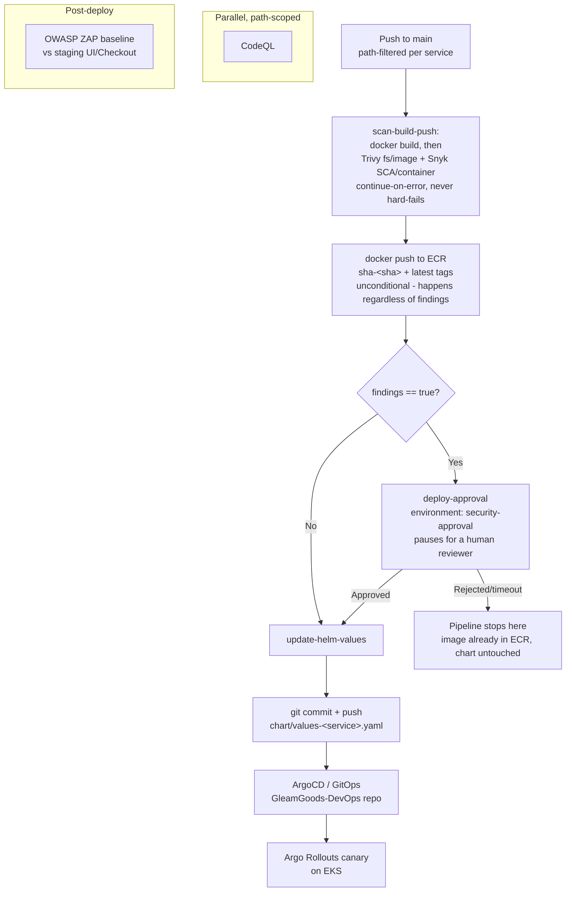

# GleamGoods CI/CD Pipeline

Technical reference for the GitHub Actions pipelines in `.github/workflows/`. 
Scope: this document covers the CI/CD that lives in **this** repo (build, scan, push, and Helm-chart update). Cluster reconciliation (ArgoCD sync, Karpenter, Rollouts) is owned by the separate [`GleamGoods-DevOps`](https://github.com/dercioanselmo/GleamGoods-DevOps) repo and is out of scope here except where the handoff matters.

---

## 1. Architecture

Each of the 5 services (`ui`, `catalog`, `cart`, `checkout`, `orders`) has its **own independent workflow**, triggered only by changes to its own source path. There is no monorepo-wide build - a commit to `src/catalog/**` never touches `ui`'s pipeline.



**Design decisions worth knowing:**

- **Scans never hard-fail the job.** Every scan step runs with `continue-on-error: true`. A `findings` output is computed from the steps' real `outcome` (not `conclusion`, which continue-on-error would mask). This means CI always completes and always reports - it never dies silently mid-scan.
- **The gate is on deployment, not on the registry push.** The built image is pushed to ECR (a private registry) regardless of findings - that carries no external exposure. What's gated behind human approval is the `update-helm-values` job, because that's the commit that GitOps actually reconciles into a running rollout. See [§6.6](#66-known-limitations--tradeoffs) for the one caveat to this (secrets).
- **Immutable image tags.** Every build produces `sha-<7-char-commit-sha>` (used in the Helm chart, what actually gets deployed) and `latest` (convenience tag for manual testing only - never referenced by any chart).
- **OIDC, not long-lived keys.** Every AWS interaction (ECR login, S3 report upload) assumes `arn:aws:iam::<account>:role/github-actions-oidc-role-gleamgoods` via GitHub's OIDC provider (`aws-actions/configure-aws-credentials`). No static AWS access keys are stored as repo secrets.

---

## 2. Workflow inventory

| File | Trigger | Purpose |
|---|---|---|
| `build-push-ui.yaml` | push to `main`, paths `src/ui/src/**` | Scan, build, push, and conditionally deploy the UI service |
| `build-push-catalog.yaml` | push to `main`, paths `src/catalog/**` (excl. `chart/**`, `*.md`) | Same, for Catalog |
| `build-push-cart.yaml` | push to `main`, paths `src/cart/src/**` | Same, for Cart |
| `build-push-checkout.yaml` | push to `main`, paths `src/checkout/src/**` | Same, for Checkout |
| `build-push-orders.yaml` | push to `main`, paths `src/orders/src/**` | Same, for Orders |
| `codeql.yaml` | PR to `main`, push to `main` (paths `src/**`), weekly cron | SAST across all 5 services, scoped to what changed |
| `dast-zap.yaml` | `workflow_run` after UI/Checkout build-push succeeds, or manual `workflow_dispatch` | DAST against staging UI/Checkout |

---

## 3. Build & push pipeline (per service)

All 5 `build-push-*.yaml` workflows share one structure: 3 jobs, `scan-build-push` → `deploy-approval` → `update-helm-values`.

### 3.1 `scan-build-push`

Steps, in order:

1. **Checkout code**
2. **Trivy Repository Scan** (`aquasecurity/trivy-action`, `scan-type: fs`, `scan-ref: .`) - `scanners: vuln,secret,misconfig`, `severity: HIGH,CRITICAL`, `ignore-unfixed: true`. Covers leaked secrets, IaC misconfig, and dependency CVEs read straight out of the manifest (`pom.xml` / `go.mod` / `package.json`).
3. **Snyk SCA scan** (`snyk/actions/<ecosystem>@master`) - source-level dependency scan against the same manifest, `--severity-threshold=high`. Ecosystem-specific action per service (see §6.2 table). Independent vulnerability DB from Trivy - deliberate redundancy, not duplication.
4. **Configure AWS credentials via OIDC**
5. **Upload Trivy repo report to S3** / **Upload Snyk SCA report to S3** (`if: always()`, so reports land even if the job later fails for unrelated reasons)
6. **Login to Amazon ECR**
7. **Define image tags** - computes `SHA_TAG=sha-<7-char-sha>` and `IMAGE_BASE=<ecr-registry>/<repo>`, exported via `$GITHUB_ENV`
8. **Build Docker image** - `docker build`, **not pushed yet**
9. **Trivy Image Scan** (`scan-type: image`) - scans the just-built local image for OS + application-layer CVEs
10. **Upload Trivy image report to S3**
11. **Snyk Container scan** (`snyk/actions/docker@master`) - scans the built image against its Dockerfile
12. **Upload Snyk container report to S3**
13. **Evaluate scan findings** - inspects `steps.<id>.outcome` (`failure`/`success`) for all 4 scan steps above; sets job output `findings=true|false`
14. **Tag and push Docker images** - pushes both `latest` and `sha-<...>` to ECR, unconditionally

### 3.2 `deploy-approval`

```yaml
needs: scan-build-push
if: needs.scan-build-push.outputs.findings == 'true'
environment: security-approval
```

Only runs when step 13 above found a HIGH/CRITICAL result. Referencing a GitHub **Environment** with required reviewers configured makes this job pause in the Actions UI until a reviewer approves or rejects it. If there are no findings, this job is skipped entirely (not run, not waited on) - clean builds deploy with zero human latency.

**Operational prerequisite:** the `security-approval` environment must exist with required reviewers configured (`Settings → Environments → security-approval → Required reviewers`). If it doesn't exist, GitHub auto-creates it with no protection rules on first reference and the job runs straight through with no pause - functionally equivalent to no gate at all. **Verify this is configured before relying on it.**

### 3.3 `update-helm-values`

```yaml
needs: [scan-build-push, deploy-approval]
if: |
  always() &&
  needs.scan-build-push.result == 'success' &&
  (needs.deploy-approval.result == 'success' || needs.deploy-approval.result == 'skipped')
```

Runs if the scan job succeeded AND (the approval job either approved or was never needed). Checks out the repo fresh (separate runner, no state carried from job 1), then:

```bash
sed -i "s|^  tag: .*|  tag: sha-${GITHUB_SHA::7}|" chart/values-<service>.yaml
git commit -m "Update <Service> image tag to sha-<...>" && git push origin main
```

This commit is the actual deployment trigger - GitOps in `GleamGoods-DevOps` reconciles from here.

### 3.4 Per-service specifics

| Service | ECR repo | Build context | Manifest scanned | Snyk SCA action | Chart values file |
|---|---|---|---|---|---|
| UI | `gleamgoods/ui` | `src/ui` | `src/ui/pom.xml` | `snyk/actions/maven` | `src/ui/chart/values-ui.yaml` |
| Catalog | `gleamgoods/catalog` | `src/catalog` | `src/catalog/go.mod` | `snyk/actions/golang` | `src/catalog/chart/values-catalog.yaml` |
| Cart | `gleamgoods/cart` | `src/cart` | `src/cart/pom.xml` | `snyk/actions/maven` | `src/cart/chart/values-cart.yaml` |
| Checkout | `gleamgoods/checkout` | `src/checkout` | `src/checkout/package.json` | `snyk/actions/node` | `src/checkout/chart/values-checkout.yaml` |
| Orders | `gleamgoods/orders` | `src/orders` | `src/orders/pom.xml` | `snyk/actions/maven` | `src/orders/chart/values-orders.yaml` |

---

## 4. SAST pipeline (`codeql.yaml`)

Two jobs: `changes` then `analyze`.

**`changes`** uses `dorny/paths-filter` to diff the push/PR against each service's `src/<service>/**` path, then builds a JSON matrix containing **only the services that actually changed**. On the weekly cron (`0 6 * * 1`), the matrix always contains all 5 services regardless of diff, to catch newly-published CodeQL query coverage independent of code changes. `analyze` is skipped entirely if the matrix is empty.

**`analyze`** runs one job per matrix entry:

| Service | Language | Build mode | Notes |
|---|---|---|---|
| ui, cart, orders | `java-kotlin` | `manual` | `./mvnw -DskipTests package -q` inside `source-root`; needs JDK 21 (Temurin) |
| catalog | `go` | `autobuild` | CodeQL's Go autobuilder handles the toolchain |
| checkout | `javascript-typescript` | `none` | No build required for JS/TS extraction |

Each entry is scoped to its own directory via `source-root`, so a UI-only PR only spawns an `Analyze (ui)` job - not all 5.

Results go to two places: GitHub's native Security tab (via the standard SARIF upload baked into `codeql-action/analyze`, which drives PR annotations), **and** `s3://<REPORT_BUCKET>/codeql-reports/<service>/<sha>/codeql-<timestamp>.sarif` for centralized storage alongside the other scan types.

---

## 5. DAST pipeline (`dast-zap.yaml`)

Triggered by `workflow_run` after the UI or Checkout build-push workflow completes successfully on `main`, or manually via `workflow_dispatch` (choose `ui` or `checkout`).

1. **Determine scan target** - maps the triggering workflow name to a service name, then reads `vars.STAGING_UI_URL` or `vars.STAGING_CHECKOUT_URL`. Fails fast with a clear message if the repo variable isn't set.
2. **Wait for staging rollout to be ready** - polls the target URL (`curl -fsS`) up to 30× at 20s intervals (10 min ceiling), since `workflow_run` firing doesn't mean GitOps has actually finished rolling out yet.
3. **Run OWASP ZAP Baseline Scan** (`zaproxy/action-baseline`) - **passive only**: spidering + passive rule checks, no active injection attempts. Safe to run against a live target. Uses `.zap/rules.tsv` to decide what's actually blocking (see §6.4). `allow_issue_writing: false` - no auto-filed GitHub issue, S3 is the report of record.
4. **Upload ZAP report to S3** - `s3://<REPORT_BUCKET>/zap-reports/<service>/<timestamp>.json`

Scope is intentionally limited to UI (public-facing) and Checkout (payment-adjacent) - Catalog/Cart/Orders are internal APIs not currently DAST-scanned.

---

## 6. Security

### 6.1 Dependency Check / SCA

Two independent engines per service, deliberately overlapping (different vulnerability databases catch different CVEs):

- **Trivy `fs` scan**, `scanners: vuln,secret,misconfig` - reads `pom.xml`/`go.mod`/`go.sum`/`package.json` directly, no dependency resolution step needed.
- **Snyk Open Source** (`snyk test` via ecosystem-specific action) - resolves the full dependency tree (invokes Maven/Go/npm tooling) for deeper transitive-dependency coverage and remediation advice.

Both run at `--severity-threshold=high` / `severity: HIGH,CRITICAL`, both `ignore-unfixed: true` for Trivy (vulnerabilities with no vendor patch yet are recorded but don't block - a conscious policy choice, not a default left unexamined).

### 6.2 Container Scan

- **Trivy image scan** (`scan-type: image`) against the just-built local image, before push - OS package CVEs (Amazon Linux 2023 / `node:20-alpine` base layers) plus application-layer (JAR) vulnerabilities.
- **Snyk Container scan** (`snyk/actions/docker`) against the same image, cross-referenced against the service's Dockerfile.

Both scan the image **before** it's pushed to ECR, so findings are known ahead of the push (though, per §1, the push itself isn't gated on them - only deployment is).

### 6.3 SAST

CodeQL, see §4. Covers all 3 languages in use (Java, Go, TypeScript/JavaScript) across all 5 services, path-scoped so PRs only analyze what changed.

### 6.4 DAST

OWASP ZAP baseline scan, see §5. Blocking policy lives in [`.zap/rules.tsv`](.zap/rules.tsv) - only 8 rule IDs are marked `FAIL`, everything else is `WARN`-and-report-only (enforced via the `-I` flag):

| Rule ID | Check | Why it's blocking |
|---|---|---|
| 10010 | Cookie No HttpOnly Flag | Session cookie stealable via XSS |
| 10011 | Cookie Without Secure Flag | Session cookie exposed over plain HTTP |
| 10023 | Debug Error Messages | Stack traces / internals leaked to clients |
| 10024 | Sensitive Information in URL | Tokens/secrets logged in access logs, browser history, referrers |
| 10035 | Strict-Transport-Security Header Not Set | MITM/downgrade risk |
| 10098 | Cross-Domain Misconfiguration | Permissive CORS |
| 10202 | Absence of Anti-CSRF Tokens | State-changing request forgery risk |
| 90022 | Application Error Disclosure | Same class as 10023 |

Everything else ZAP's baseline ruleset flags (missing `Sec-Fetch-Dest`, missing `Cross-Origin-Resource-Policy`, server header disclosure, timestamp disclosure, etc.) is real signal worth reading in the report, but not something we currently treat as release-blocking for an e-commerce app of this risk profile.

### 6.5 Approval gate architecture

Covered in detail in §3.2/§3.3. Summary: one shared GitHub Environment, `security-approval`, gates the `update-helm-values` job across all 5 services whenever any scan in `scan-build-push` reports a HIGH/CRITICAL finding. Reviewers are configured once, centrally, in `Settings → Environments`.

### 6.6 Known limitations / tradeoffs

- **Secrets are not special-cased.** Trivy's `secret` scanner findings go through the exact same non-blocking-then-approval flow as CVE findings (§3.1, step 2). Concretely: if a credential is accidentally committed and baked into an image, that image **still gets pushed to ECR immediately** (private registry, but real exposure to anyone with ECR read access) - only the Helm/deploy step is gated on approval. If this repo starts handling anything where that's unacceptable, split secret-scanner findings out to hard-fail before the `docker push` step rather than routing them through `deploy-approval`.
- **DAST's `workflow_run` trigger approximates "post-deploy."** It doesn't have visibility into whether ArgoCD has actually finished reconciling - the 10-minute readiness poll (§5, step 2) is a heuristic, not a real deployment-complete signal. There's no hard gate from a failed DAST run back to a prod-promotion step, because that promotion logic (if any exists) lives in `GleamGoods-DevOps`, outside this repo's control.
- **ZAP baseline is passive-only.** It will not find exploitable SQLi/XSS/command-injection via active attack payloads - only what's inferable from spidering and passive header/cookie/error-message inspection. A full active scan is a separate, heavier tool decision (out of scope here; active scanning against a shared staging environment also carries its own risk of side effects).
- **DAST coverage is UI + Checkout only.** Catalog, Cart, and Orders (internal APIs) are not currently scanned dynamically.
- **CodeQL Java build-mode is `manual`.** If a service's Maven build starts requiring steps beyond `./mvnw -DskipTests package -q` (e.g. a multi-module reactor build, native profile), the CodeQL step needs updating in lockstep with the Dockerfile's build step.

---

## 7. Operational prerequisites

Things that must exist outside this repo's YAML for the pipelines to function:

| Item | Where | Used by |
|---|---|---|
| IAM role `github-actions-oidc-role-gleamgoods` (trusts this repo's GitHub OIDC provider) | AWS IAM | Every workflow (ECR login, S3 upload) |
| Repo secret `AWS_ACCOUNT_ID` | Settings → Secrets and variables → Actions | Role ARN construction |
| Repo secret `SNYK_TOKEN` | Settings → Secrets and variables → Actions | All Snyk SCA/container steps |
| Repo variable `REPORT_BUCKET` | Settings → Secrets and variables → Actions → Variables | All S3 report uploads |
| Repo variable `STAGING_UI_URL` | same | DAST target for UI |
| Repo variable `STAGING_CHECKOUT_URL` | same | DAST target for Checkout |
| Environment `security-approval` with required reviewers | Settings → Environments | `deploy-approval` job, all 5 build-push workflows |

---

## 8. Report storage layout (S3)

```
s3://<REPORT_BUCKET>/
  trivy-reports/<sha>/trivy-fs-<timestamp>.json
  trivy-reports/<sha>/trivy-image-<timestamp>.json
  snyk-reports/<sha>/snyk-sca-<timestamp>.json
  snyk-reports/<sha>/snyk-container-<timestamp>.json
  codeql-reports/<service>/<sha>/codeql-<timestamp>.sarif
  zap-reports/<service>/<timestamp>.json
```

`<sha>` is the 7-character short commit SHA (`${GITHUB_SHA::7}`), consistent with the Docker image tag it corresponds to - reports for a given build are traceable back to the exact image via that shared identifier.
